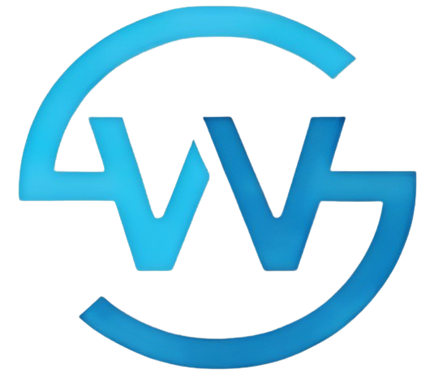

# WebsureSoft - Your Partner## ✨ Features

- **🎨 Modern Design** – Clean, professional, and mobile-first responsive design
- **⚡ High Performance** – Optimized for speed with perfect Google Lighthouse scores
- **🌍 Multi-language Support** – Available in English, Spanish, and Turkish
- **📱 Fully Responsive** – Seamless experience across desktop, tablet, and mobile devices
- **🎭 Smooth Animations** – Beautiful reveal animations and transitions
- **📝 Contact Form** – Professional contact form with email integration
- **🔧 Modern Technology** – Built with React, TypeScript, and latest web standards
- **📦 Modular Architecture** – Well-structured and maintainable codebase
- **🎯 SEO Optimized** – Search engine friendly structure and meta tags
- **📊 Easy Content Management** – Streamlined content updates and managementtions



[](https://opensource.org/licenses/MIT)
[](https://www.typescriptlang.org/)
[](https://reactjs.org/)

## 🚀 About WebsureSoft

WebsureSoft is a modern web development company specializing in creating professional, responsive websites and web applications. Built with cutting-edge technologies like React.js and TypeScript, our platform delivers exceptional digital experiences for businesses of all sizes.

We offer comprehensive web solutions with multi-language support, smooth animations, and modern design principles to help your business establish a strong online presence.

## Table of Contents

- [Features](#features)
- [Tech Stack](#tech-stack)
- [Live Website](#live-website)
- [Development Setup](#development-setup)
- [Configuration](#configuration)
- [Content Management](#content-management)
- [Deployment](#deployment)
- [Project Structure](#project-structure)
- [Performance](#performance)
- [Contributing](#contributing)
- [License](#license)
## 🛠️ Tech Stack

- **Frontend Framework**: React 18.2.0
- **Language**: TypeScript 4.9.5
- **Styling**: Styled Components 5.3.11
- **UI Library**: Ant Design 4.24.14
- **Animations**: React Awesome Reveal 3.8.1
- **Routing**: React Router DOM 5.3.4
- **Internationalization**: i18next 19.9.2
- **Email Service**: EmailJS Browser 4.4.1
- **Build Tool**: Create React App 5.0.1

## Performance

WebsureSoft achieves perfect Google Lighthouse scores across all metrics:

- **⚡ Performance**: 100/100 - Lightning-fast loading times
- **♿ Accessibility**: 100/100 - Fully accessible to all users
- **✅ Best Practices**: 100/100 - Modern web development standards
- **🔍 SEO**: 100/100 - Search engine optimized

## 🌐 Live Website

Visit our website: [www.websuresoft.com](https://neginadg.github.io/Websure-Company)

## � Development Setup

This section is for developers who want to contribute to or modify the WebsureSoft website.

### Prerequisites

- Node.js 14.0.0 or later
- npm or yarn package manager

### Local Development

1. **Clone the repository**

   ```bash
   git clone https://github.com/neginadg/Websure-Company.git
   cd Websure-Company
   ```

2. **Install dependencies**

   ```bash
   npm install
   # or
   yarn install
   ```

3. **Start development server**

   ```bash
   npm start
   # or
   yarn start
   ```

4. **Open your browser** and navigate to `http://localhost:3000`

### Build for Production

```bash
npm run build
# or
yarn build
```

## 📝 Content Management

Website content is organized in structured JSON files:

```
src/content/
├── IntroContent.json      # Homepage hero section
├── AboutContent.json      # About us section
├── ContactContent.json    # Contact information
├── MiddleBlockContent.json # Service highlights
├── MissionContent.json    # Company mission
└── ProductContent.json    # Services and products
```

### Multi-language Support

Content is available in multiple languages:

```
src/locales/
├── en/    # English
└── tr/    # Turkish
```

## 🎨 Customization

### Styling and Theming

- **Global styles**: `src/styles/styles.ts`
- **Component styles**: Individual style files in each component directory
- **Brand colors**: Modify styled-components theme variables

### Assets and Media

Website assets are organized in:

- `public/img/svg/` - Icons and logos
- `public/img/logos/` - Company and technology logos
- `public/img/icons/` - Application icons

### Code Structure

The codebase follows a modular architecture:

- `src/components/` - UI components
- `src/common/` - Shared utilities and components
- `src/pages/` - Page layouts and routing

## 🚀 Deployment

### GitHub Pages

1. **Build and deploy**
   ```bash
   npm run deploy
   ```

### Other Platforms

Deploy the `build/` folder to:

- Netlify
- Vercel
- AWS S3
- Azure Static Web Apps

## ⚙️ Configuration

### Contact Form Setup

The website includes a professional contact form powered by EmailJS:

1. EmailJS service integration for reliable email delivery
2. Form validation and user feedback
3. Detailed setup instructions in [`EMAILJS_SETUP.md`](./EMAILJS_SETUP.md)

## 📁 Project Structure

```
src/
├── components/          # React components
│   ├── AboutHero/      # About hero section
│   ├── Block/          # Generic block component
│   ├── ContactForm/    # Contact form
│   ├── ContentBlock/   # Content blocks
│   ├── Footer/         # Footer component
│   ├── Header/         # Navigation header
│   └── ...
├── common/             # Shared components
│   ├── Button/         # Reusable button
│   ├── Container/      # Layout container
│   ├── Input/          # Form inputs
│   └── utils/          # Utility functions
├── content/            # JSON content files
├── locales/            # Translation files
├── pages/              # Page components
├── router/             # Routing configuration
└── styles/             # Global styles
```

## 🤝 Contributing

We welcome contributions to improve the WebsureSoft website:

1. Fork the repository
2. Create a feature branch (`git checkout -b feature/improvement`)
3. Commit your changes (`git commit -m 'Add improvement'`)
4. Push to the branch (`git push origin feature/improvement`)
5. Open a Pull Request

## 📄 License

This project is licensed under the MIT License - see the [LICENSE](LICENSE) file for details.

## 🙏 Acknowledgments

- **[Ant Design][antd]** - React UI component library
- **[React Awesome Reveal][react-awesome-reveal]** - Animation library using Intersection Observer API
- **[Styled Components][styled-componets]** - CSS-in-JS styling solution
- **[i18next][i18next]** - Internationalization framework
- **[EmailJS](https://www.emailjs.com/)** - Email service integration

## 📞 Contact

For business inquiries or support:

1. Visit our [Contact Page](https://neginadg.github.io/Websure-Company/contact)
2. Open an issue on GitHub for development-related questions

---

**WebsureSoft** - Your partner in web solutions ✨

Built with ❤️ using modern web technologies


## License

Licensed under the MIT license.

<!-- prettier-ignore-start -->
[antd]: https://github.com/ant-design/ant-design
[react-awesome-reveal]: https://www.npmjs.com/package/react-awesome-reveal
[styled-componets]: https://github.com/styled-components/styled-components
[i18next]: https://github.com/i18next/i18next
[whoooa]: https://www.whoooa.rocks/
[Landy]: https://www.npmjs.com/package/cra-template-adrinlol
[Google Lighthouse]: https://developers.google.com/web/tools/lighthouse
<!-- prettier-ignore-end -->
